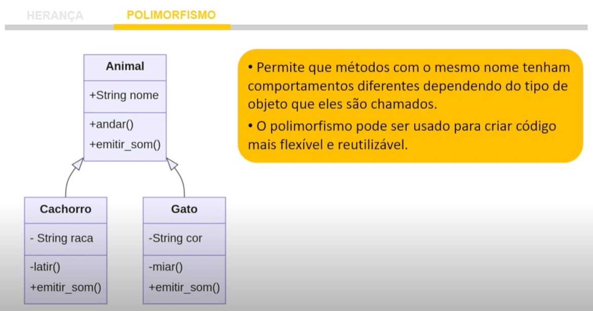

# Herança, Polimorfismo e Métodos Especiais em Programação Orientada a Objetos

# Introdução

A programação orientada a objetos é uma abordagem essencial para o desenvolvimento de software moderno. Neste artigo, exploraremos três conceitos fundamentais nessa abordagem: herança, polimorfismo e métodos especiais. Vamos entender como eles funcionam e por que são importantes na construção de programas orientados a objetos em Python.

# Herança: Construindo a Hierarquia de Classes

## Conceito de Herança

A herança é um dos pilares da programação orientada a objetos. Ela permite que uma classe herde propriedades e métodos de outra classe, criando assim uma hierarquia de classes. Em Python, essa relação de herança é estabelecida usando a palavra-chave `class`.

## Exemplo Prático de Herança

Imagine que temos uma classe chamada \"Animal\" com um atributo \"nome\" e um método \"andar\". Podemos criar subclasses como \"Cachorro\" e \"Gato\", que herdam da classe \"Animal\" e adicionam atributos e métodos específicos, como \"raça\" para o cachorro e \"cor\" para o gato.

```python
class Animal:
    def __init__(self, nome):
        self.nome = nome

    def andar(self):
        print("Estou andando")

class Cachorro(Animal):
    def __init__(self, nome, raca):
        super().__init__(nome)
        self.raca = raca

    def latir(self):
        print("Au au")

class Gato(Animal):
    def __init__(self, nome, cor):
        super().__init__(nome)
        self.cor = cor

    def miar(self):
        print("Miau")
```

Isso nos permite criar objetos das classes \"Cachorro\" e \"Gato\" que herdam os métodos da classe \"Animal\".

# Polimorfismo: Tratando Objetos de Forma Uniforme

## O Conceito de Polimorfismo

O polimorfismo permite que objetos de diferentes classes sejam tratados de maneira uniforme. Isso significa que, mesmo que objetos pertençam a classes diferentes, podemos chamar métodos com o mesmo nome neles, e cada classe pode implementar esse método de maneira específica.

## Exemplo Prático de Polimorfismo

No exemplo anterior, tanto o \"Cachorro\" quanto o \"Gato\" têm um método chamado \"emitir_som\", mas cada um deles emite um som diferente. Isso é polimorfismo em ação. Podemos chamar o método \"emitir_som\" em qualquer objeto do tipo \"Animal\", e o comportamento será específico para cada classe.



```python
cachorro = Cachorro("Rex","Vira-lata")
gato = Gato("Garfield", "Laranja")

cachorro.emitir_som()   Saída: Au au
gato.emitir_som()       Saída: Miau
```

# Métodos Especiais: Personalizando Comportamentos

## O Conceito de Métodos Especiais

Métodos especiais, também conhecidos como métodos mágicos, são métodos com nomes específicos precedidos e seguidos por dois underscores (por exemplo, `__init__` ou `__str__`). Esses métodos têm um comportamento especial no Python e podem ser usados para personalizar o comportamento de suas classes.

## Exemplo de Uso de Métodos Especiais

Um método especial importante é `__str__`, que é usado para retornar uma representação legível por humanos do objeto. Por exemplo, podemos personalizar a representação de um objeto \"Animal\" para que, ao imprimir, mostre apenas o nome do animal.

```python
class Animal:
    def __init__(self, nome):
        self.nome = nome

    def andar(self):
        print("Estou andando")

    def __str__(self):
        return self.nome

animal = Animal("Caramelo")
print(animal)   Saída: Caramelo
```

# Conclusão

A herança, o polimorfismo e os métodos especiais são conceitos fundamentais na programação orientada a objetos em Python. Eles nos permitem criar hierarquias de classes, tratar objetos de maneira uniforme e personalizar o comportamento de nossas classes. Compreender esses conceitos é essencial para se tornar um programador eficaz na construção de sistemas orientados a objetos.

Neste artigo, exploramos esses conceitos por meio de exemplos práticos em Python. Lembre-se de que a programação orientada a objetos é uma abordagem poderosa para organizar e desenvolver software, e esses conceitos são ferramentas valiosas em seu arsenal de programação.