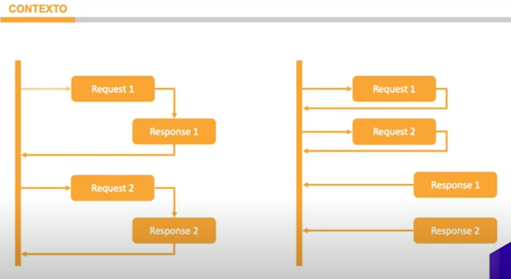

# Consumo Síncrono vs. Consumo Assíncrono na Programação

## Introdução

Na programação, o consumo síncrono e o consumo assíncrono são dois paradigmas importantes que influenciam a forma como interagimos com serviços externos e recursos de computação. Neste artigo, exploraremos esses dois paradigmas em detalhes e discutiremos suas aplicações e benefícios. Vamos entender quando usar cada um deles e como eles podem impactar nossos programas.

## Consumo Síncrono

O consumo síncrono ocorre quando fazemos uma requisição a um serviço externo e nosso programa fica bloqueado até recebermos uma resposta desse serviço. Isso significa que, enquanto aguardamos a resposta, nosso programa não pode realizar outras tarefas. O consumo síncrono é adequado quando esperamos uma resposta rápida, como em sistemas de chatbot e recomendação.

## Consumo Assíncrono

O consumo assíncrono, por outro lado, permite que nosso programa continue funcionando sem bloqueios enquanto aguarda a resposta de um serviço externo. Isso é especialmente útil quando lidamos com operações que têm tempos de resposta desconhecidos ou longos. Um exemplo disso é o processamento de solicitações de desenhos em sistemas de Inteligência Artificial, onde a resposta pode levar algum tempo. Com o consumo assíncrono, o programa não fica travado durante o processamento da requisição.

## Comparação Visual

Vamos visualizar a diferença entre esses dois paradigmas com um diagrama simples:

 

-  No consumo síncrono (à esquerda), o programa cliente aguarda a resposta do servidor antes de continuar.
-  No consumo assíncrono (à direita), as solicitações não aguardam a resposta do servidor, permitindo que o programa continue sua execução normalmente.

## Quando Usar Cada Paradigma

-  **Consumo Síncrono**: Use quando você espera uma resposta rápida e não quer que seu programa continue sem ela. É adequado para operações que têm tempos de resposta curtos.

-  **Consumo Assíncrono**: Use quando não sabe quanto tempo uma operação levará ou quando deseja manter seu programa ativo durante operações demoradas. É especialmente útil em sistemas de recomendação e processamento de dados extensos.

## Exemplos de Código

Agora, vamos dar uma olhada em alguns exemplos de código para entender como implementar cada tipo de consumo.

## Consumo Síncrono

```python
import requests

def consumir_servico_sincrono():
    resposta = requests.get("URL_DO_SERVICO")
     O programa aguarda a resposta antes de continuar
    processar_resposta(resposta)
```

## Consumo Assíncrono

```python
import aiohttp
import asyncio

async def consumir_servico_assincrono():
    async with aiohttp.ClientSession() as session:
        async with session.get("URL_DO_SERVICO") as resposta:
             O programa continua executando enquanto aguarda a resposta
            processar_resposta(await resposta.text())

 Loop de evento para gerenciar tarefas assíncronas
loop = asyncio.get_event_loop()
loop.run_until_complete(consumir_servico_assincrono())
```

## Conclusão

Neste artigo, exploramos os conceitos de consumo síncrono e assíncrono na programação e discutimos suas aplicações e benefícios. Cada paradigma tem seu lugar apropriado, dependendo das necessidades do seu projeto. É importante entender essas diferenças para tomar decisões informadas ao projetar sistemas e aplicativos. Esperamos que este conhecimento seja útil em suas futuras implementações de software.