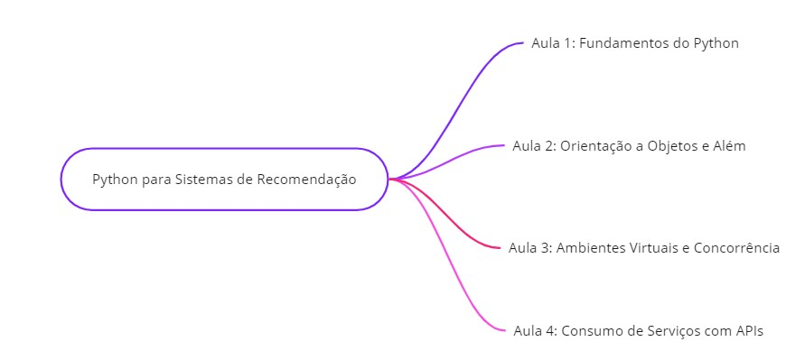
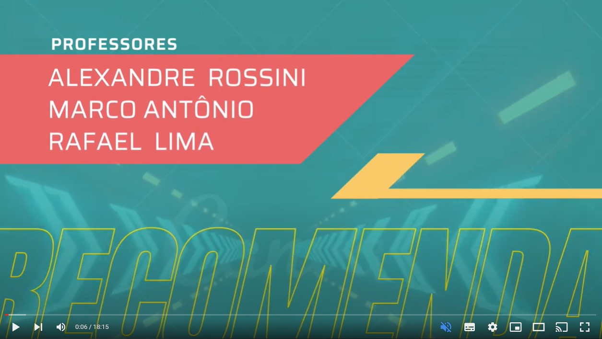

# SOFTEX_Python-Sistemas-Recomendacao
 Curso de Python para Sistemas de Recomendação

# Introdução :book:
Bem-vindos ao curso de Python para sistemas de recomendação! Neste curso, você terá a oportunidade de aprender Python, uma linguagem de programação amplamente utilizada em ferramentas de aprendizado de máquina e inteligência artificial. 

* Ministrado pelos professores Rafael, Alexandre e Marcos;
* Escrito e diponibilizado via GitHub por Otavio Augusto;

Este curso foi projetado para alunos que já possuem conceitos básicos de programação e desejam adquirir as habilidades necessárias para se destacar no mundo dos sistemas de recomendação.

# O Conteúdo do Curso
Este curso está organizado em quatro aulas, que serão distribuídas ao longo de quatro semanas. Cada aula abordará conceitos essenciais para que você possa se preparar para o módulo 2 de sistemas de recomendação. Aqui está uma visão geral do que você aprenderá em cada aula:
 

## Aula 1: Fundamentos do Python
-  Introdução ao Python e seus conceitos básicos.
-  Instalação e configuração do ambiente Python.
-  Sintaxe, tipos de dados, operadores, estruturas condicionais e loops.
-  Funções e módulos.
-  Coleções: listas, tuplas, conjuntos e dicionários.

## Aula 2: Orientação a Objetos e Além
-  Orientação a objetos em Python.
-  Classes, objetos, encapsulamento e herança.
-  Gerenciamento de exceções e expressões regulares.
-  Manipulação de arquivos e metadados.
-  Introdução a bibliotecas e pacotes úteis.

## Aula 3: Ambientes Virtuais e Concorrência
-  Criação de ambientes virtuais para isolar pacotes.
-  Introdução a testes automatizados.
-  Documentação e boas práticas de programação.
-  Noções de concorrência e paralelismo.

## Aula 4: Consumo de Serviços com APIs
-  Métodos de acesso HTTP.
-  Consumo de serviços através de APIs.
-  Trabalhando com APIs públicas.
-  Tipos de serviço RPC e gRPC.

# A Importância do Curso
Este curso serve como base sólida para o módulo 2, onde você mergulhará mais fundo no mundo dos sistemas de recomendação. Os conhecimentos adquiridos aqui são essenciais para que você possa desenvolver aplicativos de inteligência artificial e análise de dados.

# Como Funciona o Curso
As aulas são gravadas e você terá acesso a uma aula síncrona por semana (os links estão disponibilizado aqui), onde poderá interagir com os professores e colegas. Além disso, haverá atividades práticas e uma avaliação semanal para testar seu conhecimento. 

Você também terá acesso a um grupo no Telegram, onde poderá obter suporte adicional.

# Conclusão
Este curso é a porta de entrada para o emocionante mundo dos sistemas de recomendação. Os professores estão à disposição para ajudá-lo ao longo deste processo de aprendizagem. Lembre-se de manter um compromisso sério com o curso, pois seu sucesso dependerá do seu empenho e dedicação.

Bons estudos e até a próxima oportunidade!